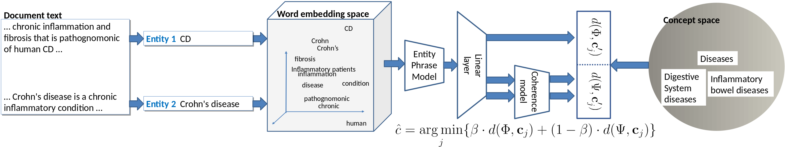

# NormCo: Deep Disease Normalization for Biomedical Knowledge Base Construction
Python implementation of NormCo: Deep Disease Normalization for Biomedical Knowledge Base Construction (Wright et al. 2019).



# Requirements
- Python 3.5
- matplotlib
- gensim 3.4.0
- nltk 3.2.4
- numpy 1.14.5
- pandas 0.22.0
- scikit-learn 0.19.0
- scipy 1.0.1
- smart\_open 1.5.7
- tqdm 4.23.4
- spacy 2.0.11
- pytorch 0.4.0
- torchvision 0.2.0

# Setup
Install [Anaconda](https://repo.anaconda.com/archive/Anaconda3-5.2.0-Linux-x86\_64.sh) (follow instructions on their website for installation.)

Create a Python 3.5 environment
```bash
$ conda create -n entity_normalization python=3.5
$ . activate entity_normalization
```

Install all required packages
```bash
$ conda install --yes --file requirements.txt
$ conda install pytorch==0.4.0 torchvision -c pytorch
```

Download the pretrained word2vec embeddings
```bash
$ mkdir data/embeddings && cd $_
$ wget http://evexdb.org/pmresources/vec-space-models/PubMed-and-PMC-w2v.bin
$ cd -
```

# Running the code
The following will describe how to generate the training and test data, train a model, evaluate a model, and run normalization on a new dataset

## Gerenating the training and test data

### Acquire third party data
To obtain the correct versions of the CTD MEDIC dictionary, first download and extract the code for [TaggerOne](https://www.ncbi.nlm.nih.gov/research/bionlp/taggerone/TaggerOne-0.2.1.tgz). Copy the file TaggerOne-0.2.1/data/BC5CDR/CTD_diseases-2015-06-04.tsv to NormCo-disease-normalization/data/BC5CDR/concept_dict.tsv. Then copy the file TaggerOne-0.2.1/data/NCBID/CTD_diseases.tsv to NormCo-disease-normalization/data/NCBID/concept_dict.tsv

Obtain the BioCreative Data [here](https://biocreative.bioinformatics.udel.edu/resources/corpora/biocreative-v-cdr-corpus/). Combine the training and validation splits into one file called "traindev_set.PubTator.txt" and rename the test split to "test_set.PubTator.txt". Place both of these files under NormCo-disease-normalization/data/BC5CDR

Obtain the NCBID data [here](https://www.ncbi.nlm.nih.gov/CBBresearch/Dogan/DISEASE/), downloading each split's complete set. Combine the training and validation splits into one file called "traindev_set.PubTator.txt" and rename the test split to "test_set.PubTator.txt". Place both of these files under NormCo-disease-normalization/data/NCBID

### Preprocessing data
The repo comes prepackaged with the rest of the data needed, located in data/\<Dataset\>. Each directory should contain the following data after acquiring the task specific data:
- concept\_dict.tsv: The concept ontology
- traindev\_set.PubTator.txt: The training and validation datasets in PubTator format
- test\_set.PubTator.txt: The test set in PubTator format
- train\_pmids.txt: List of PMIDs for training data
- dev\_pmids.txt: List of PMIDs for validation data
- test\_pmids.txt: List of PMIDs for testing data
- abbreviations.tsv: The output of the AB3P abbreviation resolver for all splits
- distant\_supervision.txt: Distantly supervised data
- tagger\_entities.txt: The NER tags produced by [TaggerOne](https://www.ncbi.nlm.nih.gov/research/bionlp/taggerone/TaggerOne-0.2.1.tgz)
- tagger\_labels.txt: The labels used by [TaggerOne](https://www.ncbi.nlm.nih.gov/research/bionlp/taggerone/TaggerOne-0.2.1.tgz) during evaluation of their model (included for evaluation consistency)
- hierarchy.tsv: TSV containing the ancestors and descendants for each node in the concept hierarchy (for LCA evaluation)
- preprocessed\_synthetic\_data.npz: Preprocessed synthetic data generated from concept co-ocurrence statistics in BioASQ

To preprocess all of the training and test data, execute the following script:
```bash
$ bash generate_data.sh <DATA_DIRECTORY> <CONCEPT_TYPE> <OUTPUT_DIRECTORY>
```
\<DATA\_DIRECTORY\> is the location of the dataset. \<CONCEPT\_TYPE\> is the type of annotation being used (i.e. 'Disease'). \<OUTPUT\_DIRECTORY\> is where the output data will be stored. For example, to preprocess the data for BC5CDR diseases and store it in a directory called "preprocessed\_data", execute the following:

```bash
$ bash generate_data.sh data/BC5CDR/ Disease preprocessed_data/
```

## Evaluating
The repository contains weights files for the best models reported in the paper, located under output/BC5CDR/model\_joint.pth\_bestacc\_00023 and output/NCBID/model\_joint.pth\_bestacc\_00010. To evaluate a model, execute the following shell script:

```bash
$ bash evaluate.sh <PREPROCESSED_DATA> <MODEL_FILE>
```
\<PREPROCESSED\_DATA\> is the directory where the preprocessed data was generated. \<MODEL\_FILE\> is the trained model file to load. For example, to evaluate the best model on the BC5CDR dataset, execute the following command:

```bash
$ bash evaluate.sh preprocessed_data/BC5CDR output/BC5CDR/model_joint.pth_bestacc_00023
```

To change the model parameters, edit the evaluate.sh script. To see all of the available parameters, execute the following command.

```bash
$ python entity_normalization/eval.py -h
```

**NOTE:** to test the model with mentions only, uncomment the line "--mention_only" in evaluate.sh

## Inference on new data
A trained model can be used to run normalization on a new set of documents. To do so, first obtain the tagged documents in a tab separated file with the following columns:

MeSH IDs&nbsp;&nbsp;&nbsp;&nbsp;&nbsp;&nbsp;&nbsp;&nbsp;Mentions&nbsp;&nbsp;&nbsp;&nbsp;&nbsp;&nbsp;&nbsp;&nbsp;       Spans&nbsp;&nbsp;&nbsp;&nbsp;&nbsp;&nbsp;&nbsp;&nbsp;PMID

Each row should be an individual document. The MeSH ID column should be blank for each row. The Mentions column should be a "|" separated list of surface text mentions (i.e. "colorectal cancer|breast cancer|Crohn Disease"). The Spans column should be a "|" separated list of the spans for each mention (i.e. "0 17|21 35|105 119"). The PMID column should contain the document ID.

To normalize a set of documents, execute the following command.

```bash
$ bash normalize.sh <PREPROCESSED_DATA> <MODEL_FILE> <TAG_FILE>
```
\<PREPROCESSED\_DATA\> is the directory where the preprocessed data was generated. \<MODEL\_FILE\> is the trained model file to load. \<TAG\_FILE\> is the TSV containing the tagged documents. The output will be a TSV containing the tagged documents with the MeSH IDs column filled with the normalized concepts.

To change the model parameters, edit the normalize.sh script. To see all of the available parameters, execute the following command.

```bash
$ python entity_normalization/normalize.py -h
```

## Training a new model
To train a model, execute the following shell script:

```bash
$ bash train.sh <PREPROCESSED_DATA> <MODEL_OUTPUT_DIRECTORY>
```
\<PREPROCESSED\_DATA\> is the directory where the preprocessed data was generated. \<MODEL\_OUTPUT\_DIRECTORY\> is the directory where the trained model will be saved to. For example, to train a model on the BC5CDR dataset, execute the following command.

```bash
$ bash train.sh preprocessed_data/ output/
```

To change the training parameters, edit the train.sh script. To see all of the available parameters for training, execute the following command.

```bash
$ python entity_normalization/train.py -h
```

# Citing
If you find this work useful for your research, please use the following citation:

@inproceedings {    
    wright2019normco:,    
    title={NormCo: Deep Disease Normalization for Biomedical Knowledge Base Construction},    
    author={Wright, Dustin and Katsis, Yannis and Mehta, Raghav and Hsu, Chun-Nan},    
    booktitle={Automated Knowledge Base Construction},    
    year={2019},    
    url={https://openreview.net/forum?id=BJerQWcp6Q}, 

}
